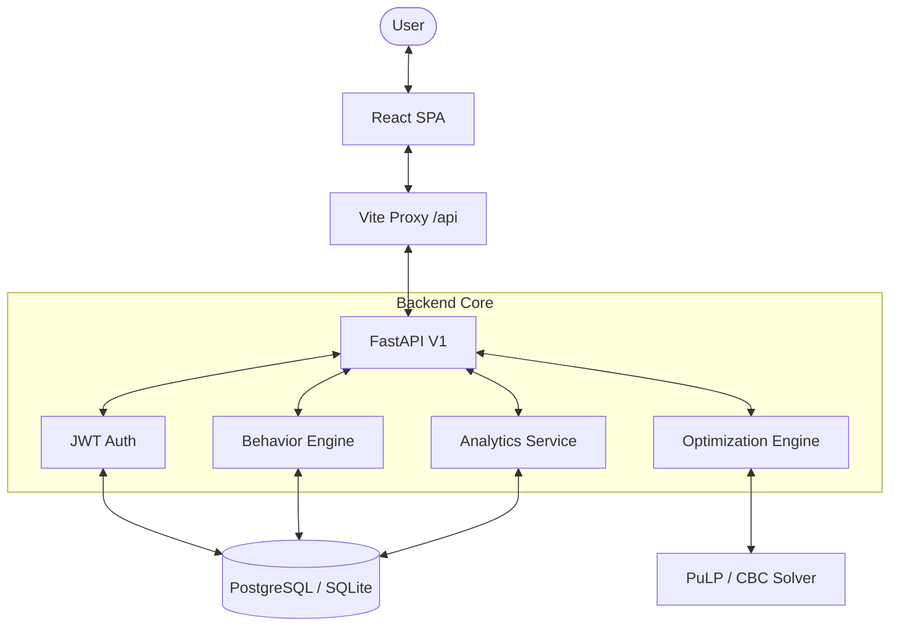

# 🎯 HabitOS: Behavioral Optimization Platform

<div align="center">


[](https://opensource.org/licenses/MIT)
[](https://fastapi.tiangolo.com/)
[](https://reactjs.org/)
[](https://www.typescriptlang.org/)
[](https://www.docker.com/)
[](https://www.python.org/)

**A production-grade Operations Research + AI Engineering platform for optimizing daily behaviors and life goals.**

[Explore Docs](file:///workspaces/HabitOS/docs) • [View API Demo](http://localhost:8000/docs) • [Report Bug](https://github.com/yusuuf-mm/HabitOS/issues)

</div>

---

## 📋 Table of Contents
- [Project Overview](#-project-overview)
- [System Architecture](#-system-architecture)
- [Mathematical Core](#-mathematical-core)
- [Tech Stack](#-tech-stack)
- [Quick Start](#-quick-start)
- [Codespaces Guide](#-codespaces-guide)
- [Testing Suite](#-testing-suite)
- [Roadmap](#-roadmap)

---

## 📋 Project Overview

HabitOS is a **full-stack decision support system** that leverages **Mathematical Optimization** (Linear Programming) to transform abstract life goals into concrete, actionable daily schedules.

Unlike traditional habit trackers, HabitOS treats your time and energy as finite resources in an optimization problem, ensuring your daily actions perfectly align with your long-term objectives.

### 🏆 Key Capabilities
- 🧠 **Dynamic Scheduling**: Automatically generates optimal daily routines based on weighted life objectives.
- ⚡ **Resource-Aware**: Models energy costs and time budgets for every behavior.
- 📊 **Impact Modeling**: Quantifies how specific habits (e.g., "Morning Jog") contribute to broad goals (e.g., "Health").
- 🔒 **Enterprise-Ready**: Includes JWT authentication, Pydantic validation, and comprehensive integration testing.

---

## 🏗️ System Architecture

HabitOS follows a modern decoupled architecture, ensuring scalability and maintainability.



---

## 🧠 Mathematical Core

At its heart, HabitOS uses **Mixed-Integer Linear Programming (MILP)** to solve the Daily Schedule Optimization Problem (DSOP).

### 1. Variables
- $x_{b,t} \in \{0, 1\}$: Binary variable indicating if behavior $b$ is scheduled at time period $t$.
- $d_{b,t} \in [min\_dur, max\_dur]$: Continuous variable for the duration of behavior $b$.

### 2. Objective Function
We maximize the **Total Life Value (TLV)**:
$$\max \sum_{b \in B} \sum_{t \in T} \left( \sum_{o \in O} w_o \cdot impact_{b,o} \right) \cdot d_{b,t}$$
Where $w_o$ is the user-defined weight for objective $o$.

### 3. Key Constraints
- **Time Budget**: $\sum_{b,t} d_{b,t} \leq \text{Available Time}$
- **Energy Budget**: $\sum_{b,t} energy\_cost_b \cdot d_{b,t} \leq \text{Daily Energy Capacity}$
- **Exclusivity**: $\sum_{b} x_{b,t} \leq 1$ (Only one behavior at a time)
- **Preferences**: $x_{b,t} = 0$ if $t \notin \text{Preferred Slots}_b$

---

## 🛠️ Tech Stack

| Layer | Technologies |
| :--- | :--- |
| **Frontend** | React 18, TypeScript, Tailwind CSS, Vite, Lucide Icons |
| **Backend** | FastAPI, Pydantic V2, SQLAlchemy 2.0, PuLP, Uvicorn |
| **Database** | PostgreSQL (Production), SQLite/aiosqlite (Dev), Alembic Migrations |
| **Security** | JWT (HS256), Bcrypt Hashing, CORS, Vite Proxy |
| **DevOps** | Docker, Docker Compose, Makefile, Pytest, Vitest |

---

## 🚀 Quick Start

### 1. Unified Setup (Recommended)
You can run both the frontend and backend simultaneously from the root directory:

```bash
# Install root dependencies (concurrently)
npm install

# Run full stack
npm run dev
```

### 2. Manual Backend Setup
```bash
cd backend
make setup        # Install deps and run migrations
make run          # Start FastAPI on port 8000
```

### 3. Manual Frontend Setup
```bash
cd frontend
npm install
npm run dev       # Start Vite on port 8080
```

---

## ☁️ Codespaces Guide

Running HabitOS in GitHub Codespaces? We've pre-configured everything for you:

1.  **CORS & Proxy**: The frontend uses a Vite proxy (`/api`) to avoid "Failed to fetch" errors.
2.  **Ports**: 
    -   Frontend: `8080` (Auto-forwarded)
    -   Backend: `8000` (Internal proxy target)
3.  **Environment**: Port forwarding handles the external accessibility.

---

## 🧪 Testing Suite

We maintain high confidence through a multi-layered testing strategy.

### Backend Integration Tests
Tests real API flows against a live database:
```bash
cd backend
pytest tests_integration/
```

### Optimization Verification
Ensures the solver returns valid schedules:
```bash
pytest backend/tests/test_optimization_engine.py
```

---

## 🔮 Roadmap

- [x] **Core OR Engine**: Linear programming integration.
- [x] **Schema Alignment**: Multi-layer pydantic-to-typescript synchronization.
- [ ] **Advanced Solvers**: Integration with Gurobi and CPLEX for complex constraints.
- [ ] **AI Recommendation**: LLM-driven suggestions for behavioral weights.
- [ ] **Mobile Integration**: Progressive Web App (PWA) support.

---

## 🤝 Contributing

Contributions are welcome! Please read [CONTRIBUTING.md](file:///workspaces/HabitOS/docs/CONTRIBUTING.md) for details on our code of conduct and the process for submitting pull requests.

## 📝 License

This project is licensed under the MIT License - see the [LICENSE](file:///workspaces/HabitOS/LICENSE) file for details.

---

<div align="center">
  Built with ❤️ by the HabitOS Team
</div>
